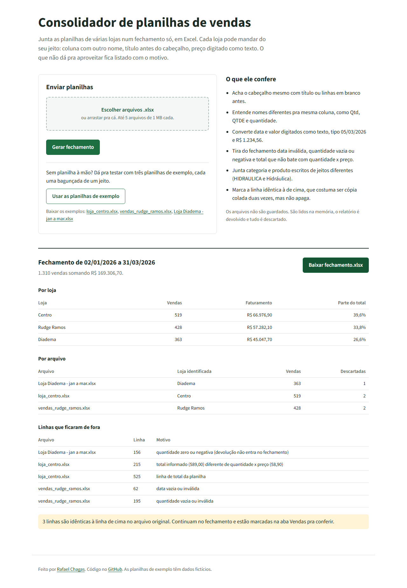

# Consolidador de planilhas de vendas

Junta as planilhas de vendas de várias lojas num fechamento só, em Excel.

**Testar online:** https://consolida-planilhas.vercel.app (tem um botão que usa planilhas de exemplo, não precisa ter arquivo)



## O problema

Numa rede com três ou quatro lojas, é comum cada gerente mandar a planilha do mês do seu jeito. Uma tem título antes do cabeçalho,
outra chama a coluna de "QTDE" em vez de "Quantidade", outra tem o preço digitado como texto ("R$ 1.234,56"). Alguém do
escritório passa horas copiando, colando e corrigindo antes de conseguir somar.

Este projeto faz essa parte. Recebe os arquivos .xlsx e devolve um Excel com três abas:

- **Resumo**: faturamento por loja, por mês (com gráfico), por categoria e os 10 produtos que mais faturaram. Os totais e percentuais são fórmulas, então quem mexer nos valores vê a soma mudar.
- **Vendas**: todas as linhas aproveitadas, já limpas, numa tabela do Excel com filtro. Cada linha diz de qual arquivo e de qual linha veio.
- **Descartadas**: o que ficou de fora, com o motivo e o conteúdo original da linha.

## O que ele trata

| Situação na planilha | O que acontece |
| --- | --- |
| Título ou linhas em branco antes do cabeçalho | Procura o cabeçalho nas 20 primeiras linhas de cada aba |
| Nomes diferentes pra mesma coluna (Qtd, QTDE, quantidade) | Reconhece por uma lista de sinônimos, sem diferenciar acento e maiúscula |
| Data e valor digitados como texto | Converte "05/03/2026", "R$ 1.234,56", "1234,5" |
| Data impossível (31/02) ou vazia | Descarta com o motivo |
| Quantidade vazia, zero ou negativa | Descarta. Devolução não entra no fechamento |
| Total diferente de quantidade x preço | Descarta mostrando os dois valores |
| Linha de TOTAL no fim da planilha | Descarta, pra não somar duas vezes |
| "HIDRAULICA" numa loja e "Hidráulica" na outra | Junta usando a forma que mais aparece |
| Linha idêntica à de cima | Mantém e marca pra conferir, porque pode ser cópia colada duas vezes ou venda real |

O nome da loja vem da coluna "Loja" ou "Filial", se existir. Se não, sai do nome do arquivo: `Loja Diadema - jan a mar.xlsx` vira "Diadema".

## Como usar

Pela página, é só escolher os arquivos. Pela linha de comando:

```bash
python -m venv .venv
.venv/Scripts/activate      # Linux/macOS: source .venv/bin/activate
pip install -r requirements-dev.txt

python -m consolida exemplos -o fechamento.xlsx
```

Aceita pasta ou arquivos soltos (`python -m consolida vendas_centro.xlsx vendas_diadema.xlsx`).

Pra rodar a página localmente:

```bash
uvicorn app.main:app --reload
```

As planilhas em `exemplos/` têm dados fictícios e são geradas por `scripts/gerar_exemplos.py`. Cada uma tem um tipo de bagunça diferente.

## Segurança do upload

Como a página recebe arquivo de qualquer pessoa, o envio passa por algumas travas antes de chegar no openpyxl:

- Até 5 arquivos por vez, 1 MB cada e 4 MB no total. O tamanho é conferido antes de ler o corpo da requisição.
- Só .xlsx. O conteúdo precisa começar com a assinatura de zip e ter `xl/workbook.xml`; a extensão sozinha não basta.
- Planilha com macro (`vbaProject.bin`) é recusada.
- Contra zip bomb, a soma dos tamanhos descompactados não pode passar de 30 MB.
- O XML é lido com `defusedxml`, que bloqueia entidades externas e expansão de entidades.
- Texto que vem da planilha enviada e começa com `=` é gravado como texto no relatório, nunca como fórmula.
- Limite de 12 envios por minuto por IP e campo escondido contra bot.
- Nada é salvo em disco ou banco. O arquivo é lido na memória e descartado depois da resposta.
- A resposta da API não devolve o conteúdo das linhas descartadas, só arquivo, linha e motivo. O conteúdo fica dentro do Excel gerado.

## Estrutura

```
consolida/arquivo.py      validação do .xlsx recebido
consolida/colunas.py      sinônimos e busca do cabeçalho
consolida/conversao.py    conversão de data, número e texto
consolida/leitura.py      lê uma planilha e separa vendas e descartadas
consolida/consolidar.py   junta os arquivos e calcula os totais (pandas)
consolida/relatorio.py    monta o Excel de saída (openpyxl)
consolida/__main__.py     linha de comando
app/main.py               API (FastAPI) usada pela página
public/                   página
tests/                    70 testes
```

## Testes

```bash
pytest
```

Cobrem a conversão de valores, a busca do cabeçalho, cada motivo de descarte, a junção de nomes, os totais, a proteção contra fórmula injetada e as travas do upload (arquivo falso, macro, zip bomb, limite por IP).

O CI roda ruff, os testes, `pip-audit` e a linha de comando com as planilhas de exemplo a cada push.

## Limitações

- Não lê .xls (Excel 97-2003) nem .csv. Quem tiver arquivo antigo precisa salvar como .xlsx antes.
- A página mostra até 100 linhas descartadas. A lista completa sempre vai na aba Descartadas.
- O limite por IP fica na memória de cada instância do servidor, então é uma proteção básica.
